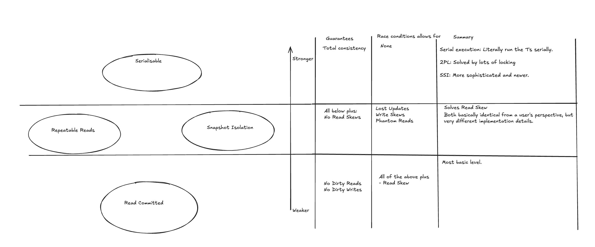
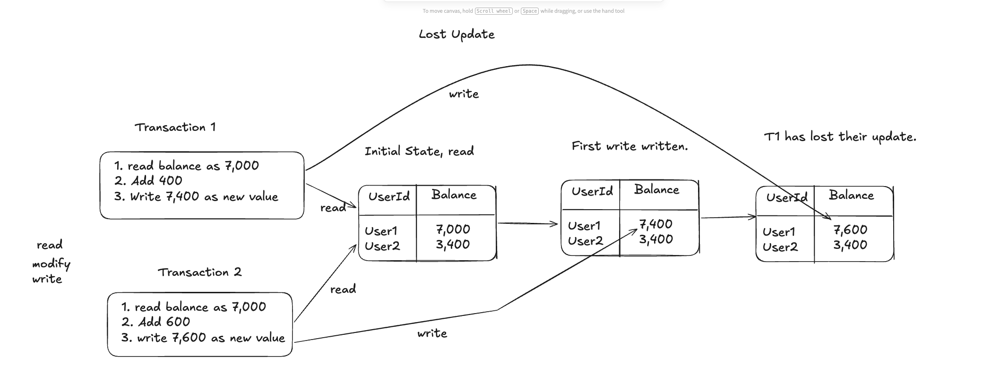
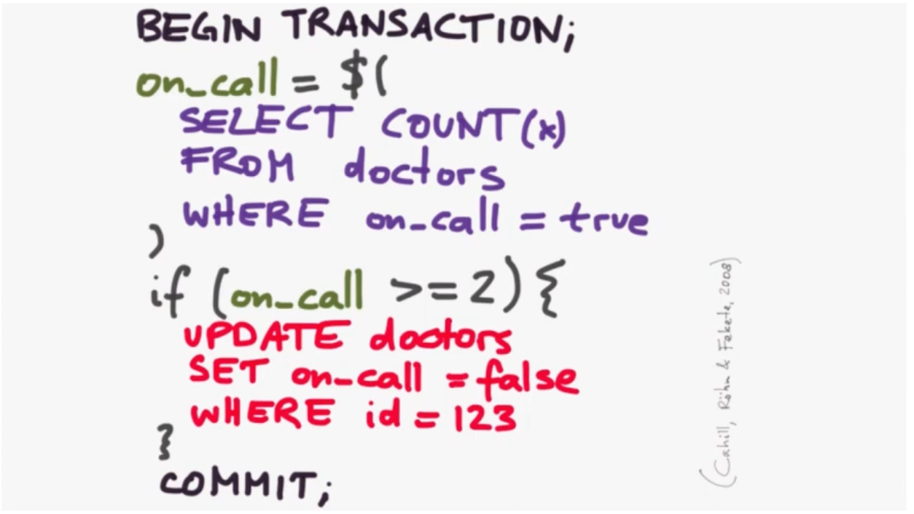
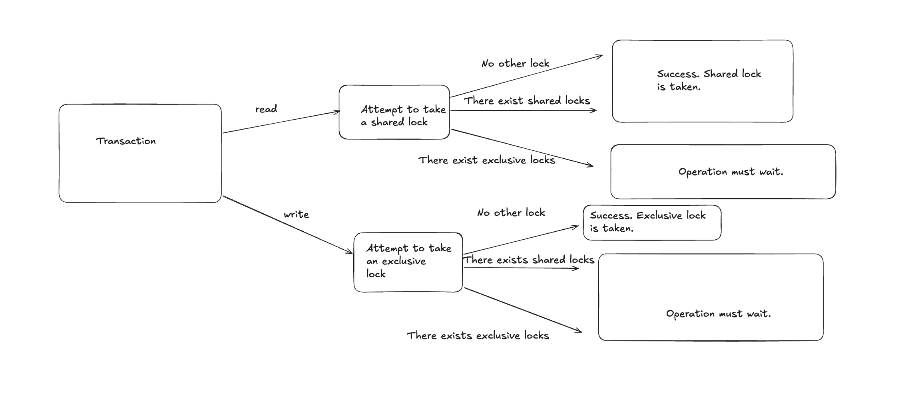

# Chapter 8: Transactions

When writing to a db, loads of things can go wrong. Transactions prevent the fallout of a lot of this. It 'allows the application to ignore certain potential error scenarios and concurrency issues, because the database takes care of them instead' (p278).

The first of these - allowing the developer to ignore certain error scenarios - comes under the 'A' of ACID - Atomicity. Could also be called 'all-or-nothing' and have a good similar effect. But essentially all of your operations are bunched into a single unit and succeed or fail together. This allows for consistency guarantees and for you to be able to reason about things much easier. It won't prevent the problem (a failure at some point in the system) but it can stop the negative consequences of it.

The second of these - allowing the developer to ignore at least some concurrency issues - comes under the 'I' of ACID - Isolation. As will be seen, the 'at least some' qualifier is needed because this depends on what isolation guarantee the database gives us. We can have much weaker forms of isolation that just prevent no dirty reads and no dirty writes (e.g Read-committed isolation) all the way through to serialisable isolation where the guarantee is strongest and allows the developer to operate on the assumption that they will run *as if* the transactions were being run one after the other.

As always, how strong you want your isolation guarantee trades off with performance - weaker isolation guarantees generally means more potential to be performant, but with reduced consistency guarantees. And vice versa.

## What is ACID?

- **Atomicity:** All the items in your transaction will be written or fail together.
- **Consistency:** Guarantee that your data respects the invariants of your application code. Kleppmann points out that really this is down to the application.
- **Isolation:** Concurrently executing transactions are isolated from each other.
- **Durability:** Data is persisted to disk if the transaction is successful. Nowadays maybe also is replicated.

C isn't really a condition. D is pretty basic in terms of whether or not you have it.

There's a little bit of ambiguity around Atomicity. And the book reflects that. There's a few sections on what this means:

- Single-object or multi-object Operations. (Combined with how this ties into isolation levels too.)

But really, the bulk of this chapter is for the I in ACID (Isolation).

## History

### The Origin of Transactions

- **1973:** Davies and Bjork papers. 'Spheres of Control'. Applied to general computing, not specifically databases. A sphere enclosed a piece of work whose effects could be: (i) committed, (ii) backed out, (iii) isolated from surrounding work, (iv) nested inside another sphere.
- **1974 (but not actually in print until 1976):** Idea taken specifically to databases and the word 'Transaction' is given to it. (Eswaran et al paper)
- **1975:** System R started to be developed. Created and implemented SQL and Transactions more as we know them in a relational database. In a separate talk Kleppmann says that the typical types of isolation:
  - Serialisable, repeatable reads, read committed, read uncommitted

  Are all coined in this db also.
  - Snapshot Isolation seems to come later (1995 paper)
- **1981:** Gray paper (Gray worked on System R and involved a lot in the IBM research around this). Attempt to define a Transaction more clearly:

  > 'A transaction is a transformation of state which has the properties of atomicity (all or nothing), durability (effects survive failures) and consistency (a correct transformation).'

  So, missing the 'I', but this is implicitly included in consistency.
- **1983:** Harder and Reuter paper where canonical definition of a Transaction is given via ACID acronym.
- **1995:** Snapshot Isolation via Berenson, Gray et al paper: <https://www.microsoft.com/en-us/research/wp-content/uploads/2016/02/tr-95-51.pdf>

### The Move Away from Transactions

- **Late 2000s:** NoSQL databases come onto the scene and prioritise availability and low latency over consistency. Transactions were a fatality of this. Transactions trade off consistency for slowing things down, and making the db more available. With rise of distributed computing Transactions were often what got cut.
- **2006:** Google's BigTable
- **2007:** Amazon's Dynamo (not to be confused with DynamoDB)(This is also the reference that Kleppmann gives in Replication chapter on what popularised leaderless replication).
- **2008:** BASE paper (Basically available, Soft State, Eventual Consistency)

Then: 'NewSQL'. Transactional implementations introduced into new distributed systems stuff. Seen as bridging the best of both worlds, to a degree.

- **2012:** Google's Spanner paper
- **2014:** Cockroach DB started, released in 2017 (I think). Inspired heavily by Spanner.

But NewSQL stuff flipped that narrative. CRDB, TiDB, Spanner, FoundationDB, YugabyteDB all incorporate Transactions and are highly scalable databases.

## Single-Object and Multi-Object Operations

Multi-object transactions require some way of determining which read and write operations belong to the same transaction. In Relational DBs, this is typically done based on the client's TCP connection to the db server.

But many non-relational databases don't have this ability. (Surely this isn't why they don't allow for MO transactions?)

### Single-Object Writes

A and I also apply when a single object is being changed. Example of writing a large JSON object. Storage engines almost universally aim to provide atomicity and isolation the level of a single object. Therefore the suggestion is that satisfying this criterion does not qualify for saying you support Transactions.

### Need for Multi-Object Transactions

Could we do without Multi-object writes? And just be safer and do everything single-object like NoSQL often does? List given of v plausible use cases where this wouldn't work:

- Row in 1 table has a FK reference to a row in another table.
- DBs with secondary indexes, indexes need to be updated every time you change a value. Without transaction isolation, possible for a record to appear in one index but not in the other.

### Handling Errors and Aborts

There are some ways it can go wrong when we simply retry an aborted transaction.

- The retry mechanism is only worth doing if you're facing a transient error.
- If the transaction actually succeeded, but the network was interrupted while the server tried to acknowledge the successful commit to the client, then retrying the transaction causes it to be performed twice unless you have an additional application-level de-dupe mechanism in place.
- If the transaction has side effects, you don't want to retry without some sort of safety mechanism in place.

## Weak Isolation Levels

The weakest isolation level is Read Committed. This provides a guarantee of no dirty reads, and no dirty writes.

On a step-up from Read Committed, we have Repeatable Reads and Snapshot Isolation. These are basically indistinguishable for a user, but have very different implementation details. Repeatable reads utilises locks more, and was implemented in the original System R database. Snapshot Isolation came in 1995, and uses more sophisticated techniques like MVCC.

### Read Committed

Makes two guarantees:

- When reading from the db, you will see only the data that has been committed (no dirty reads)
- When writing to the database, you will overwrite only data that has been committed. (No dirty writes).

The most common way to prevent *dirty writes* is to use row-level locks. When a transaction wants to modify a particular row, it must first acquire a lock on that row. It then holds that lock until the transaction is committed or aborted.

To prevent dirty reads, we could implement the same locking mechanism. But this is usually overkill for performance-wise since it blocks reads more frequently than is required. More common:

> 'For every row that is written, the database remembers both the old committed value and the new value set by the transaction that currently holds the write lock. While the transaction is ongoing, any other transactions that read the row are simply given the old value' (p293).

Some dbs support an even weaker level: Read uncommitted. Prevents dirty writes but doesn't prevent dirty reads. This can provide better perf (expected). However, says that it can reduce the probability of lost updates.

Trying to get clear on this last bit. A few possible explanations jump out. But first, we should be clear that fundamentally a lost update is a read-modify-write race condition where two transactions will read the same value simultaneously, both update it, but then only the last to successfully commit their transaction will get the update. The first one to commit will have their update lost, hence the name.

1. By avoiding dirty reads you will get more up-to-date data from your reads. You therefore reduce the risk of stale data and rely on the fact that most transactions will not fail, therefore increasing your odds of avoiding a lost-update but increasing the risk overall of other types of inconsistent data issues.

### Snapshot Isolation and Repeatable Reads

In addition to the guarantees that Read Committed gives you, these Isolation levels also guarantee you against *read skew*. Read skew is a race condition that will be fixed if you re-read, but is a temporary bad read.

Snapshot isolation is the most common solution to this problem. The idea is that each transaction reads from a consistent snapshot of the database - it sees all the data that was committed to the database at the start of the transaction.

- To implement, typically uses write locks to prevent dirty writes. This blocks other writes.
- But reads don't need locks.
- Readers never block writers and writers never block readers.
- Generally implemented using a generalisation of the mechanism for preventing dirty reads, but instead of just using 2 versions of each row, the db must potentially keep many versions. Hence MVCC - Multi-version concurrency control.

So, we can say that MVCC is an implementation technique to achieve snapshot isolation.

### Preventing Lost Updates

This next section follows the general core: Snapshot Isolation is quite good, and prevents certain race conditions. And does so in a more efficient way than traditional approaches of taking out locks. It also - as we see - laid the foundations of serialisable snapshot isolation that was published in 2008, which most modern serialisability is built upon.

But it nonetheless leaves the developer using it open to various race conditions.

- Lost Updates. Bad, but preventable relatively fine nowadays.
- Write skews. Worse, but can be prevented.
- Phantoms, particularly write skews that involve phantoms. Worse still, and even harder to prevent without serialisability.

#### Lost Update

Take two transactions T1 and T2. Both handle the shared state of user1's balance.

- (1) T1 reads from the database - user1's balance is 7000.
- (2) T2 reads from the database - user1's balance is 7000.
- (3) T1 updates their value to the database - user1's balance is 7,400.
- (4) T2 updates their value to the database - user1's balance is 7,600.

But we now finish this process with an incorrect balance for user1. It should be 8,000, instead it's 7,600. The first update has been lost.

No individual step is wrong. Yet clearly something has gone wrong. *The problem only exists at the level of the schedule*; it only exists when taking all the steps together as a whole. And it's not correct because the observable outcomes of running these transactions is not the same as if we ran them serially, i.e. ran them one after the other.

A bit more formally: ≥ 2 transactions each (a) read object S and (b) write S, where the value written is derived from the value read, and at least one transaction's write lands between another's read and that other's write.

- It's not seen as damning, because it's both more easily preventable, and SSI automatically prevents it.

##### Atomic Write Operations

- The bit that does the damage for LUs is the gap between the read and the write. In this gap, another Transaction can commit to the db and make the value you read from stale. So, writing directly removes this gap, and solves the issue.
- Instead of doing a read-modify-write, you just do a write directly. E.g. `UPDATE` syntax, no reads.
- ORM frameworks can make it easy to accidentally write code that perform unsafe read-modify-write cycles.

ORMs often require this - or at least make it the more straightforward option. You need to first bring the data into memory, then you update the data in memory, and then write back to the database. I know some ORMs do have options to do straight writes (`UPDATE`s), but often more of a niche feature.

##### Explicit Locking

- use the application to explicitly lock objects that are going to be updated.
- Carries risks of (i) you can always forgot to implement this if it's your policy, (ii) is a blocking operation and can cause deadlocks.

##### Automatically Detecting Lost Updates

Alternatively, we can allow them to happen in parallel, and let the db do the work. Lots of databases at the Snapshot Isolation level detect for this automatically.

##### Conditional Writes

Some databases allow for conditional writes - an operation that prevents lost updates by allowing an update to happen only if the value has not changed since you last read it.

- Sometimes called optimistic locking.

#### Conflict Resolution and Replication

If your db is replicated, preventing LUs takes on another dimension. Because the dbs have copies of the data on multiple nodes and data can potentially be modified concurrently on different nodes, additional steps need to be taken.

Generally, techniques based on locks or conditional writes don't apply in the context of multi-leader or leaderless, since they allow several writes to happen concurrently.

Instead, a common approach is to allow concurrent writes to create several conflicting versions, and to use application code or specialised data structures to resolve and merge these versions after the fact.

### Write Skews and Phantoms

A more subtle class of race conditions between concurrent writes. And nastier than LUs because not straightforward to fix.

We can think of Write Skews as a generalisation of the Lost-Update problem.

So, we imagine two transactions, T1, T2, reading this at the same time. Both read 2, and so both proceed down this branch. Both update, but after both T1 and T2 have committed, then there are no doctors on call. 

Whereas LUs require >=2 Transactions to (a) read the same state, (b) update the same state that they read from, Write Skews hold (a) but inverts (b) as a condition, and also add a third condition - (c) - that the two differing writes, taken together, violate some invariant that would not have been violated had the transactions run serially.

- write skews are particularly difficult because they violate these invariants which can't simply be blocked by things like atomic writes. The atomic write would have an invariant in it which is still violated because it depends on data that is rendered stale by an incoming write from another Transaction in your set of Ts.

- With preventing write skew, the ways to prevent it are more limited vs LUs. Atomic single-object operations don't help, as multiple objects are involved.
- Automatic detection of LUs that you find in some implementation of SI doesn't help. To automatically prevent, this requires true serialisation.
- If you don't use serialisability, the 2nd best option is probably to explicitly lock the rows that the transaction depends on.

#### Phantoms Causing Write Skews

A phantom is a phenomenon where whilst you are reading from a specific range in your database that matches a certain criteria, the specific range is mutated (updated/deleted/inserted to) which will not have been taken into account when you have initially made the read that determines what items need to be updated. The data you have read and will go on to make decisions informed by, has now changed.

Snapshot Isolation avoids phantoms in read-only queries, but not for transactions that involve writes.

You can materialise conflicts, but serialisability is far preferable.

## Serialisability

3 different ways to do serialisability:

- Literally execute transactions one after the other
- 2PL. First established technique, 1976 (?), established formally in 'Notions of Consistency and Predicate Locks in a database system'. In the Pessimistic CC family.
- Optimistic concurrency control, e.g. serialisable snapshot isolation. First proposed 2008 'Serializable Isolation for Snapshot Databases' (Cahill et al). This takes Snapshot isolation (1995) and makes it serialisable

### Actual Serial Execution

May seem obvious, but only been > 2000s that this has been do-able, given that we need single-threaded loops for executing the transactions. RAM became cheap enough to keep the entire active dataset in memory, and designers realised that OLTP transactions are usually short and make only a small number of reads and writes.

- Implemented in VoltDB, H-Store, Redis, Datomic.

#### Encapsulating Transactions in Stored Procedures

Solves the problem of back-and-forth over a network - you just have all the stuff you need on the db side, and run it via the SP.

#### Sharding

Executing all transactions serially makes concurrency control much simpler, but it limits the transaction throughput of the database to the speed of a single CPU core on a single machine

#### Summary of Serial Execution

Serial execution of transactions has become viable due to recent computing. Has certain constraints:

- Every transaction must be small and fast, because it only takes 1 slow transaction to stall all transaction processing.
- Most appropriate when the active dataset can fit in memory.
- Write throughput must be low enough to be handled on a single CPU core, or else transactions need to be sharded without requiring cross-shard co-ordination.
- Cross-shard transactions are possible, but their throughput is hard to scale.

### Two-Phase Locking (2PL)

2PL was the only algorithm used for serialisability in databases for around 30 years. 

Readers block writers, but not readers. Writers block both readers and writers. 

#### Implementation of 2PL

Implemented by having a lock on each object on the database. Lock can be either shared mode or exclusive mode. Then:

#### Performance

Bad, because you basically stop transactions running concurrently if they touch the same object. Step better than running them serially, but still quite slow. 

#### Predicate Locks

You can't just take out locks on individual objects and prevent serialisability. This will not prevent phantoms. To solve this, we need a predicate lock. 

Importantly, a predicate lock applies even to object that don't yet exist in the database, but that might be added in the future.

#### Index-range locks

Naturally, predicate locks don't perform well. Consequently, most databases using 2PL implement index-range locking (sometimes known as next-key locking). This is a simplified approximation of predicate locking. 

